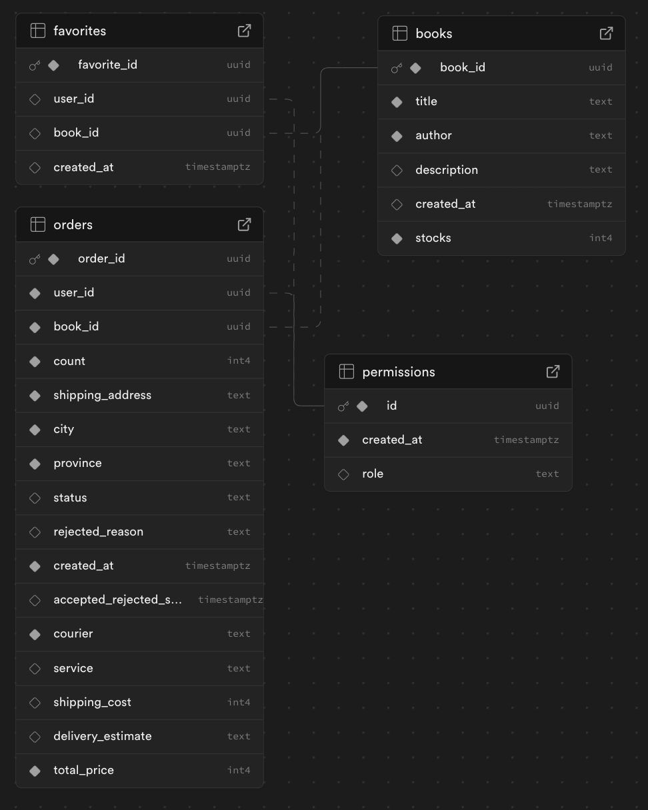

# To Do (It will be removed once completed)

- [] Signup Cookies are not deleted after signup.
- [] The verify email callback is not following best practices.
- [] Implementing Supabase Auth Best Practices for Server and Client (Create Action).
- [] Fix middleware for checking authentication and authorization (permission/role).
- [] Check out feature (multiple order).
- [] Pagination feature.
- [] High Ordered Component implementation (?).
- [] Order feature with realtime rajaongkir API for provinces, cities, and cost.

# Mini Project Sistem Dashboard Buku

<div align="center">
  <h2>Next Js 14.x + MUI 5.x + TypeScript 4.x + Tailwind CSS 3.x + Supabase (auth & database) 2.x</h2>
  <p>
    This is a mini project that creates a dashboard system with Role-Based Access Control (RBAC), data manipulation (CRUD), and authentication using Supabase. It provides a simple way to manage and control access to data, ensuring that users with different roles can interact with the system according to their permissions.
  </p>

</div>

## Features

This repository is 🔋 battery packed with:

- ⚛️ React 18.x
- ✨ TypeScript
- 💨 Material UI — Ready to use Material Design components [check here for the usage](https://mui.com/material-ui/getting-started/usage/)
- 🎨 React Hook Form — Performant, flexible and extensible forms with easy-to-use validation
- ⏰ Day.js — A modern day JavaScript Date Library
- 🔥 Utils: getApiResponse - consoleLog
- 🃏 Jest — Configured for unit testing
- 📈 Absolute Import and Path Alias — Import components using `@/` prefix
- 📏 ESLint — Find and fix problems in your code, also will **auto sort** your imports
- 💖 Prettier — Format your code consistently
- 🐶 Husky & Lint Staged — Run scripts on your staged files before they are committed
- 🤖 Conventional Commit Lint — Make sure you & your teammates follow conventional commit
- ⏰ Release Please — Generate your changelog by activating the `release-please` workflow
- 👷 Github Actions — Lint your code on PR
- 🚘 Automatic Branch and Issue Autolink — Branch will be automatically created on issue **assign**, and auto linked on PR
- 🔥 Snippets — A collection of useful snippets
- 👀 Open Graph Helper Function — Awesome open graph generated using [og](https://github.com/theodorusclarence/og), fork it and deploy!
- 🗺 Site Map — Automatically generate sitemap.xml
- 📦 Expansion Pack — Easily install common libraries, additional components, and configs.

## Getting Started

### 1. Clone this repo

```
git clone https://github.com/dzaky-pr/mini-project-supabase-dashboard.git
```

### 2. Install dependencies

It is encouraged to use **yarn** so the husky hooks can work properly.

```bash
yarn install
```

### 3. Run the development server

You can start the server using this command:

```bash
yarn dev
```

Open [http://localhost:3000](http://localhost:3000) with your browser to see the result. You can start editing the page by modifying `src/pages/index.tsx`.

### 4. Change defaults

There are some things you need to change including title, urls, favicons, etc.

Find all comments with !STARTERCONF, then follow the guide.

Don't forget to change the package name in package.json

### 5. Commit Message Convention

This starter is using [conventional commits](https://www.conventionalcommits.org/en/v1.0.0/), it is mandatory to use it to commit changes.

## Supabase Detail

### Database Schema

> **Note**: The order feature, database schema, and everything related to this feature, both for admins and users, are still under development!



#### favorites

This table stores data about books that users like.

- **favorite_id (UUID)**: Unique ID for each favorite.
- **user_id (UUID)**: ID of the user who likes the book.
- **book_id (UUID)**: ID of the liked book.
- **created_at (timestamptz)**: Time when the favorite was created.

#### orders

This table stores data about book orders from users.

- **order_id (UUID)**: Unique ID for each order.
- **user_id (UUID)**: ID of the user who placed the order.
- **book_id (UUID)**: ID of the ordered book.
- **count (int4)**: Number of books ordered.
- **shipping_address (text)**: Shipping address.
- **city (text)**: Shipping city.
- **province (text)**: Shipping province.
- **status (text)**: Order status.
- **rejected_reason (text)**: Reason for rejection if the order is rejected.
- **created_at (timestamptz)**: Time when the order was created.
- **accepted_rejected_status_at (timestamptz)**: Time when the order was accepted or rejected.
- **courier (text)**: Courier name.
- **service (text)**: Shipping service type.
- **shipping_cost (int4)**: Shipping cost.
- **delivery_estimate (text)**: Estimated delivery time.
- **total_price (int4)**: Total order price.

#### books

This table stores data about available books.

- **book_id (UUID)**: Unique ID for each book.
- **title (text)**: Book title.
- **author (text)**: Book author.
- **description (text)**: Book description.
- **created_at (timestamptz)**: Time when the book was added.
- **stocks (int4)**: Number of books available in stock.

#### permissions

This table stores data about user permissions.

- **id (UUID)**: Unique ID for each permission entry.
- **created_at (timestamptz)**: Time when the permission was created.
- **role (text)**: User role (e.g., admin, user).

### Functions

#### create_user_on_signup

This function is triggered when a user signs up. It inserts a new permission entry with the user's ID.

```sql
BEGIN
  INSERT INTO public.permissions (id)
  VALUES (
    NEW.id
  );
  RETURN NEW;
END;
```

#### is_admin

This function checks if a user is an admin. It returns `true` if the user's role is 'admin'.

```sql
BEGIN
  RETURN (SELECT role FROM permissions WHERE permissions.id = (SELECT auth.uid())) = 'admin';
END;
```

#### is_user

This function checks if a user is a regular user. It returns `true` if the user's role is 'user'.

```sql
BEGIN
  RETURN (SELECT role FROM permissions WHERE permissions.id = (SELECT auth.uid())) = 'user';
END;
```

#### update_status_timestamp

This function updates the `accepted_rejected_status_at` timestamp when the order status changes.

```sql
BEGIN
  IF NEW.status IS DISTINCT FROM OLD.status THEN
    NEW.accepted_rejected_status_at := CURRENT_TIMESTAMP;
  END IF;
  RETURN NEW;
END;
```

### Triggers

#### create_user_on_signup

This trigger is activated when a user signs up and calls the `create_user_on_signup` function.

#### update_status_timestamp

This trigger is activated after an update on the orders table and calls the

## Format

`<type>(optional scope): <description>`
Example: `feat(pre-event): add speakers section`

### 1. Type

Available types are:

- feat → Changes about addition or removal of a feature. Ex: `feat: add table on landing page`, `feat: remove table from landing page`
- fix → Bug fixing, followed by the bug. Ex: `fix: illustration overflows in mobile view`
- docs → Update documentation (README.md)
- style → Updating style, and not changing any logic in the code (reorder imports, fix whitespace, remove comments)
- chore → Installing new dependencies, or bumping deps
- refactor → Changes in code, same output, but different approach
- ci → Update github workflows, husky
- test → Update testing suite, cypress files
- revert → when reverting commits
- perf → Fixing something regarding performance (deriving state, using memo, callback)
- vercel → Blank commit to trigger vercel deployment. Ex: `vercel: trigger deployment`

### 2. Optional Scope

Labels per page Ex: `feat(pre-event): add date label`

\*If there is no scope needed, you don't need to write it

### 3. Description

Description must fully explain what is being done.

Add BREAKING CHANGE in the description if there is a significant change.

**If there are multiple changes, then commit one by one**

- After colon, there are a single space Ex: `feat: add something`
- When using `fix` type, state the issue Ex: `fix: file size limiter not working`
- Use imperative, and present tense: "change" not "changed" or "changes"
- Don't use capitals in front of the sentence
- Don't add full stop (.) at the end of the sentence

## References

This project is built using the boilerplate starter template from the following repository:

- [Next.js Materia MUI TypeScript Hook Form Scaffold Boilerplate Starter](https://github.com/AlexStack/nextjs-materia-mui-typescript-hook-form-scaffold-boilerplate-starter)
